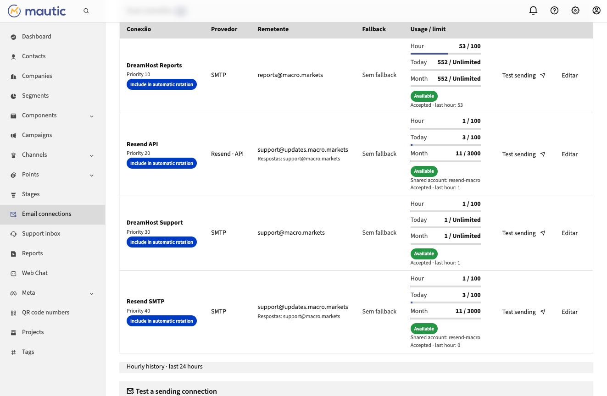
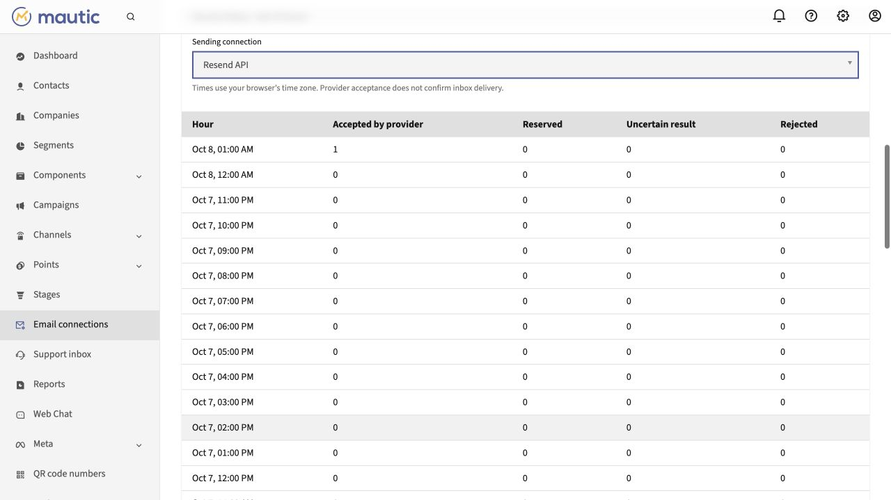

# Multi Mail for Mautic

Independent Mautic 7.2 / Symfony Mailer 7.4 plugin (v0.4.0) for multiple SMTP and API connections, with an ordered fallback chain per connection. No Inbox dependency, no core patch, no campaign/use-case segmentation and no automatic credential expiry.

## Install

Extract `MauticMultiMailBundle` into Mautic's `plugins/` directory. The release ZIP bundles official Symfony bridges for Amazon SES, Resend, Mailgun, SendGrid, Postmark, Brevo, Mailjet, MailerSend and Mandrill; SparkPost and SMTP2GO use the existing Symfony HTTP client with plugin-owned adapters; existing framework dependencies retain precedence. Register this plugin and rebuild the container and configured Twig cache (`MAUTIC_TWIG_CACHE_DIR`) using your deployment workflow. ZIPs preserve timestamps: refresh template timestamps if the Twig cache is stored outside the cleared kernel cache. There are no entities, migrations or plugin tables. On installations with custom schema-install subscribers, register only this plugin's metadata and avoid a broad reload of unrelated plugins.

Administrator screen: `/s/mail-connections`. Connections are stored as private JSON outside the web root: `<deployment>/shared/inbox-mail-private` for atomic releases, or `<project-parent>/<project-name>-multimail-private` otherwise. The atomic-release directory name preserves existing credentials; direct checkouts use separate storage per installation. Directory permissions are 0700, files 0600. Include this private directory in your protected backups; never publish it in ZIPs or Git.

## Supported providers

SMTP, Amazon SES, Resend, Mailgun, SendGrid, Postmark and Brevo remain available. Version 0.3.0 adds:

| Provider | Credentials and account requirements | Adapter / notes |
| --- | --- | --- |
| Mailjet | API Key + Secret Key from the same account; verified sender/domain | Official `symfony/mailjet-mailer`, Send API v3.1. Every recipient result must report success. |
| MailerSend | API token with sending access; verified domain | Official `symfony/mailer-send-mailer`. Empty HTTP 202 responses require `x-message-id`; suppression warnings are handled. The standard bridge does **not** send custom tracking/unsubscribe headers. Use SMTP for messages requiring these headers. |
| Mandrill / Mailchimp Transactional | Transactional API key; authenticated sending domain | Official `symfony/mailchimp-mailer`. Every recipient must be sent, queued or scheduled; rejected/invalid recipients cannot be mistaken for acceptance. |
| SparkPost | Transmissions write API key; account region US or EU | Fixed regional HTTPS endpoint, full RFC 822 MIME and explicit delivery envelope. SparkPost manages the return path. Extra open/click tracking is disabled so Mautic links are retained. |
| SMTP2GO | API key with `email/send` permission; verified sender/domain | Fixed HTTPS endpoint, text/HTML, Reply-To, supported custom headers, base64 attachments and CID images. `fastaccept=false` requires actual acceptance counts. At most 100 envelope recipients and at least one To recipient. |

All five appear in **New connection**, use the existing private credential store, and become available to **Test sending**, native **Send example** and per-connection reserves after saving a real account. Their addition does not create accounts, change the global transport, edit existing connections or choose a new fallback order. HTTP redirects are disabled for these API calls. SparkPost/SMTP2GO requests are capped at 20 MiB of serialized JSON, including attachments; their adapters never fetch remote attachment URLs. Provider-specific file/size limits still apply.

Success validation runs before an official bridge can treat an HTTP 200/202 as acceptance. Diagnostic results retain a safe provider message ID and HTTP status. A partial response, missing identifier, malformed JSON, suppression warning, timeout or HTTP 5xx stops the reserve chain. SparkPost HTTP 422 may already include accepted recipients and is always treated conservatively. A fully rejected business response is identified in the standalone diagnostic; it does not widen the existing campaign fallback policy beyond 401/403/429. This is acceptance validation, not bounce processing or a delivery receipt.

Setup references: [Mailjet](https://dev.mailjet.com/docs/email-api/send-api-v31/send-basic-email), [MailerSend](https://developers.mailersend.com/api/v1/email), [Mandrill](https://mailchimp.com/developer/transactional/api/messages/send-new-message/), [SparkPost](https://developers.sparkpost.com/api/transmissions/), [SMTP2GO](https://developers.smtp2go.com/reference/send-standard-email).

## Sending quotas and automatic rotation

Each SMTP/API connection has editable recipient limits per rolling hour, UTC calendar day and UTC calendar month, plus priority and participation controls. `0` means unlimited. Lower priorities are used first. Configure the account limit from your provider contract; the plugin does not assume all accounts or plans have the same allowance. Multiple connections to the same service are supported. The UI shows used/remaining capacity, available/capped status, next capacity time and 24-hour per-connection acceptance, pending reservation, uncertainty and rejection history. Refreshing counters is an authenticated, administrator-only, no-store GET and does not submit the credential form.

Use the same **Shared quota account** identifier for API/SMTP or multiple credentials belonging to one provider account. Their usage is combined and the lowest positive member limit for each period applies, even if one member is set to unlimited or excluded from automatic rotation. Per-connection acceptance counts remain separate. Changes to a charged connection’s quota group are refused until hourly usage and usage in capped calendar periods clear. An active provider quota block also prevents regrouping. This prevents an edit from silently resetting its used allowance. Removing an account does not erase its counters. Blank fields preserve secrets and saves still check the registry revision.

The hour is a rolling 60-minute window. Daily usage resets at **00:00 UTC**; monthly usage resets on **day 1 at 00:00 UTC**. All envelope recipients (To, Cc and Bcc) count. All three windows must have capacity before handoff. `0` means no locally configured cap for that period. Calendar aggregates persist separately from the 24-hour minute history, so monthly usage survives history cleanup; accepted handoffs crossing a boundary charge the completion period and pending reservations remain conservative.

**Resend Free** currently permits 100 emails/day and 3,000/month per team, shared by API and SMTP. Configure those actual account limits rather than interpreting 100/day as 100/hour. Confirmed Resend API `daily_quota_exceeded`/`monthly_quota_exceeded` HTTP 429 refusals block that shared account until its UTC reset and allow the next independent account. Ordinary request-rate throttling does not create a day/month block. Source: [Resend account quotas](https://resend.com/docs/knowledge-base/account-quotas-and-limits).

The ledger counts traffic routed through Multi Mail; it does not continuously reconcile external apps or Resend inbound traffic. A controlled activation can seed verified provider-dashboard daily/monthly totals once (`HourlyQuota::importPeriodUsage`); imports never lower charged capacity or discard pending reservations. The current production sending key is not authorized for Resend `GET /usage` (full-access permission required), so this release does not claim an automatic provider-usage sync or expand key permissions. Recheck dashboard usage after traffic outside this plugin. Source: [Resend usage API](https://resend.com/changelog/account-usage-api).

Global transport `multimail://auto` enables rotation for native Mautic sending, including campaigns and examples sent using the global transport. Configure scheme `multimail`, host `auto` and empty credentials/port in Mautic email settings. The first enabled SMTP/API connection with enough capacity for **all** envelope recipients is used; a capped connection is skipped before network handoff. The message is not split. Ordinary unsigned emails use each selected connection’s saved From/Reply-To and envelope sender, retaining content, tracking, unsubscribe headers and attachments according to that provider’s adapter. Signed/raw messages retain their existing MIME and sender; those sender identities must be authorized by the selected providers. Explicit `multimail://<id>` choices preserve Mautic’s sender and follow only that connection’s configured reserves, while obeying the same quotas. The standalone diagnostic also charges capacity but never uses reserves.

Quota reservations use a private, atomic JSON ledger protected by the same filesystem security policy as credentials, with a separate process-wide file lock. Concurrent PHP workers reserve recipient capacity before sending and hold no filesystem lock while contacting a provider. Accepted and uncertain handoffs retain their charge; confirmed non-acceptance releases it. Finalizing a successful send cannot turn it into a failure/retry if the ledger becomes unavailable: its persisted reservation stays conservative. Unfinished reservations are retained conservatively for up to the 24-hour ledger retention, rather than assuming a crashed worker did not send. Completed charges move to the provider-handoff completion minute. Rolling minute buckets retain the overlapping oldest minute, so reopening capacity can be delayed by up to 60 seconds; wall-clock hour changes cannot reset the quota early.

When all eligible connections are capped, no provider request occurs. A typed quota exception triggers the plugin’s campaign-failure subscriber, which supplies a retry interval to **Mautic’s existing scheduler**, even when its global retry interval is unset. Campaign actions remain pending and retry as capacity becomes available, including a full monthly reset interval; no core patch, database table, custom queue daemon or migration is introduced. Manual example/diagnostic sends report the limit and must be retried by the operator; standalone diagnostics return HTTP 429 with no provider handoff. Other provider failures retain the existing confirmed-refusal versus uncertain-handoff fallback policy, so ambiguous sends are never routed to another account.

Only traffic using a Multi Mail SMTP/API transport is counted. Direct use of original SMTP/provider DSNs bypasses this ledger; native passthrough/composite transports preserve their original optional interfaces and do not participate in quota rotation. During a controlled activation, operators can seed the first account’s actual last-hour accepted counts using `HourlyQuota::importAccepted()` with timestamp/count data and a unique idempotent reference. This method is not exposed through the web UI. Keep `hourly-usage.json` and its lock private and include the ledger in protected backups; do not reset it during deployments.

Run `php Tests/hourly-quotas.php` for isolated rotation, shared-account, rolling-window, outcome, campaign retry and concurrent PHP-process tests. These tests use synthetic contracts and temporary files, never a Mautic kernel, database, real credentials or network.

See [validation and rollout notes](docs/hourly-validation.md) for the isolated checks and controlled provider handoff validation.

## Native Mautic sending

### Test a connection and send native examples

Each saved connection has **Test sending**. Choose a saved connection and one recipient in `/s/mail-connections`; the diagnostic uses that connection's saved From and Reply-To. It does not change the global Mautic configuration. The standalone diagnostic never invokes the registry fallback chain; a native DSN keeps its own explicitly configured composite. The result distinguishes acceptance, confirmed refusal and uncertain handoff. Acceptance is not a delivery receipt: check the recipient's inbox and spam. Do not retry an uncertain result without checking for delivery. Tests are administrator-only, protected by CSRF, optimistic revision checks and a ten-second session cooldown. No provider credentials or debug transcripts are returned.

For administrators, the native email **Send example** modal now requires an explicit sending choice: a saved connection, or the current Mautic transport. Selecting a connection preserves native email rendering and the chosen transport receives Mautic’s From, Reply-To, recipient envelope and attachments. API providers reassemble messages according to their capabilities; see the provider notes below. Only that connection's configured fallback applies; an unavailable or failed selection never silently uses the global transport. The selection applies only to this example and does not change campaign routing. Use a provider that authorizes the email's Mautic sender.

The connections page shows the active global transport and marks a saved connection as active only when its ID exactly matches the configured `multimail://` DSN. Registering a connection alone still does not switch the global transport. No arbitrary connection is automatically promoted by registration; global `multimail://auto` is an explicit opt-in.

For Resend API diagnostics the result retains the provider's email ID and HTTP response code. Known error names are allowlisted; raw API bodies, exceptions, credentials and recipients are never included in the result. HTTP 400/404/405/422 is a rejected diagnostic; network failures, malformed successful responses and HTTP 5xx remain uncertain and are never retried through another connection. The campaign fallback policy is unchanged. A successful POST confirms acceptance, not inbox delivery. A sending-only Resend key can send and return an ID but cannot list/retrieve email history (`401 restricted_api_key`); delivery reconciliation requires separately authorized read access or a webhook integration.

The latest completed diagnostic is retained in the operator's session for that connection and registry revision, so reloading after a lost browser response can recover it without sending again. It is not a persistent delivery/audit history and contains no recipient, message content or credentials.

Implementation uses a native Symfony named transport appended after the original transports, a form extension and Mautic's pre-send event. The original default transport and optional batching/bounce interfaces remain intact. Internal routing headers survive a Messenger queue and are removed before provider handoff. No Mautic core file is patched.

Edit a connection to obtain its identifier. In Mautic's email transport configuration use scheme `multimail`, host `<connection-id>` and empty user/password/port: `multimail://<connection-id>`. Saving the connection registry does not activate the global transport. Activation is an explicit operator decision. Multi Mail passes the configured From, Reply-To, recipient envelope and original message to the chosen transport. SMTP and SparkPost carry full MIME; the other APIs reassemble content and headers according to their adapters and account features. All configured providers must authorize the sender used by Mautic.

Applications using the injected native Mautic mail helper/transport factory can reuse this transport. Symfony's static `Transport::fromDsn()` does not discover registered plugin factories; use the application's injected factory instead. Existing custom login transports continue using their current configuration until explicitly switched.

### Preserve any installed transport

Choose **Mautic · transporte nativo / DSN** to store the original DSN of any adapter already installed in Mautic, including SMTP options, provider bridges and third-party factories. The full DSN is private; a blank edit preserves it. When selected through `multimail://<connection-id>`, the plugin delegates to Mautic's existing factory and returns the exact original transport object. It does not wrap that object, change its options or duplicate its events. Optional Mautic batching, bounce and unsubscription interfaces remain present when the original adapter implements them.

For a native connection use the original transport's own `failover(...)` or `roundrobin(...)` DSN when appropriate. Native connections are not mixed into Multi Mail's independent fallback graph, which would hide adapter-specific capabilities and send outcome information. Recursive references to `multimail://` are rejected. A bridge must already be installed; this mode does not claim that every Symfony provider is bundled.

The plugin's registered factory accepts only `multimail`; all original DSN schemes and registered factories continue resolving through Mautic as before. Existing global configuration stays unchanged. Third-party integrations that inspect the global DSN text directly or implement additional custom configuration still require their original configuration and their own integration validation; returning the same transport does not invent compatibility for undocumented plugin behavior.

## Fallback

Each connection may point to one reserve; reserves may have their own reserve. Cycles and removal of a referenced connection are rejected. Credentials remain private and blank edits preserve them. Changes use optimistic revisions and an atomic private write.

SMTP requires TLS. Failures before DATA acceptance or explicit final 4xx/5xx refusal allow fallback. API authentication/permission/rate-limit refusals (401/403/429) allow fallback. A timeout, uncertain handoff, malformed successful response, HTTP 5xx or recipient/payload rejection stops the chain to avoid duplicate delivery. Provider exceptions/debug transcripts are not propagated. Existing Mautic retry settings still apply; this plugin does not provide a cross-job idempotency ledger or provider delivery reconciliation.

New bounce, complaint, delivery webhook processing or provider callback endpoints are not added by this plugin. Native mode preserves the original adapter and its existing interfaces/configuration; the nine bundled standard Symfony API bridges and two direct API adapters do not add Mautic-specific batch/callback features. Configuration storage and native sending are the current scope. A configured API bridge is not proof of credentials, sender verification, SES production access or end-to-end delivery.

## Validation

`php Tests/period-quotas.php` checks UTC day/month boundaries, leap years, durable monthly counts, legacy-ledger upgrades, atomic accounting, shared caps, provider refusal blocks, diagnostic behavior and concurrent workers. `node Tests/quota-ui.cjs` checks refresh of all three counters and safe recovery from incomplete responses. Both use isolated files/mocks without a kernel, database or network. Operational evidence is recorded in [calendar quota validation](docs/period-validation.md).

`php Tests/provider-transports.php` exercises all five new provider protocols using mocked HTTP and a temporary private registry. It verifies endpoints/authentication, region and credential validation, secret preservation/redaction, explicit recipient envelopes, stream text/HTML/attachments, inline CID images, provider IDs, refusal versus partial acceptance, diagnostic classification and reserve boundaries. It also proves oversized direct API requests never reach the HTTP client. No real keys, network or database are used. Actual delivery for each new account still requires its credentials and verified sender; availability in the UI is not evidence of delivery.

`node Tests/connections-ui.cjs` exercises the client with synthetic DOM/HTTP contracts. It covers a form field named `action` shadowing the form's endpoint property, disabled connection serialization, duplicate clicks, safe literal rendering, provider details, session-result visibility and a lost/non-JSON response. The submit handler reads the form's `action` attribute, preserving the hidden operation field without letting it replace the URL.

`php Tests/example-sending.php` adds pure diagnostic/routing tests with mocked HTTP, synthetic connections and real Symfony form/CSRF/choice validation. It proves that invalid recipients, stale revisions, invalid CSRF, forged choices and non-admin requests do not select a transport, a failed choice cannot use the global transport, routing headers do not reach the provider, and native MIME/attachments remain intact. It also checks the Resend send endpoint/authentication, JSON controller results, provider ID/HTTP preservation, error redaction, refusal/timeout/malformed-response handling, session recovery and throttling. The controller harness uses an isolated CommonController contract, never the real Mautic kernel. Install the isolated development dependencies first. The runtime ZIP excludes these extra test dependencies.

`php Tests/connections.php` tests private storage, credentials, revisions, fallback graph and atomic releases. After `composer install --working-dir=build/dependencies`, `php Tests/transports.php` tests official transport construction, mocked Resend sending/fallback, MIME payload/envelope, event counts and simulated SMTP acceptance boundaries. `php Tests/native-compatibility.php` compares the original factory registry with and without Multi Mail, exercises native composites, compiles the lazy dependency graph, and checks transport object identity, batching/bounce/unsubscription interfaces and private DSN preservation. Tests use temporary filesystem data, mocked HTTP and a simulated stream. They never boot a Mautic kernel, connect to a database or send network traffic.

Release validated against the installed Mautic 7.2.0-rc / Symfony Mailer 7.4.12 environment. No compatibility claim for Mautic 5/6 or undocumented third-party plugin behavior. GitHub CI checks PHP 8.2, 8.3, 8.4 and 8.5 against both the locked dependencies and the installed Mautic baseline (Mailer7.4.12, HttpClient7.4.9, Mime7.4.13, EventDispatcher/DI7.4.14). The current matrix covers 43 registered transport schemes, with no kernel/database/network tests.

## Source and releases

Source: https://github.com/raphaelcangucu/mautic-multi-mail-bundle

Installable release ZIPs are published under GitHub Releases. The repository contains no credentials or private registries; build a ZIP with `python3 build/package.py` after installing the isolated build dependencies.
